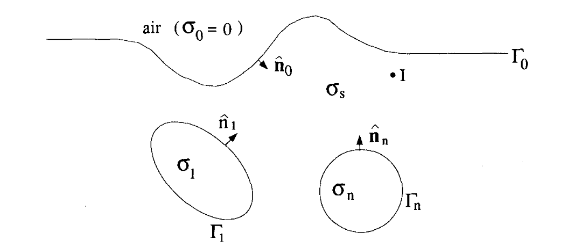

## Aspects of charge accumulation in d.c. resistivity experiments

_Yaoguo Li & Douglas W. Oldenburg_

[https://doi.org/10.1111/j.1365-2478.1992.tb00554.xX](https://doi.org/10.1111/j.1365-2478.1992.tb00554.x)

## Summary

We investigate different aspects of  charge accumulation and its fundamental role in d.c. experiment 

## Citation

Szarka, L. (1992). COMMENT ON ‘ASPECTS OF CHARGE‐ACCUMULATION IN D.C. RESISTIVITY EXPERIMENTS’ BY Y. LI AND D. W. OLDENBURG1. Geophysical Prospecting, 40(7), 823–828. https://doi.org/10.1111/j.1365-2478.1992.tb00554.x

